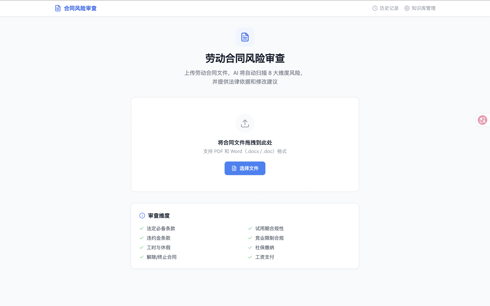
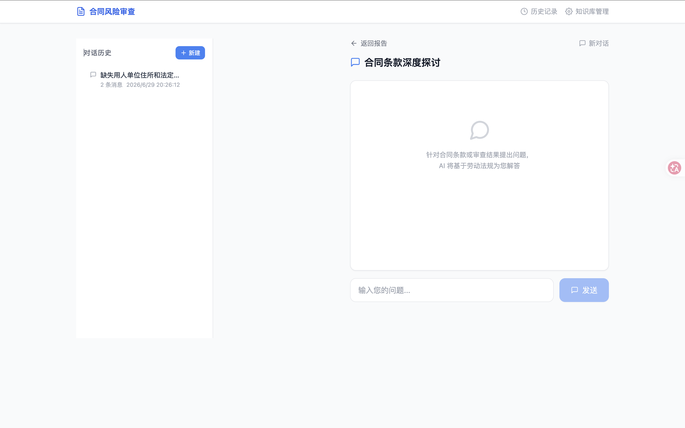
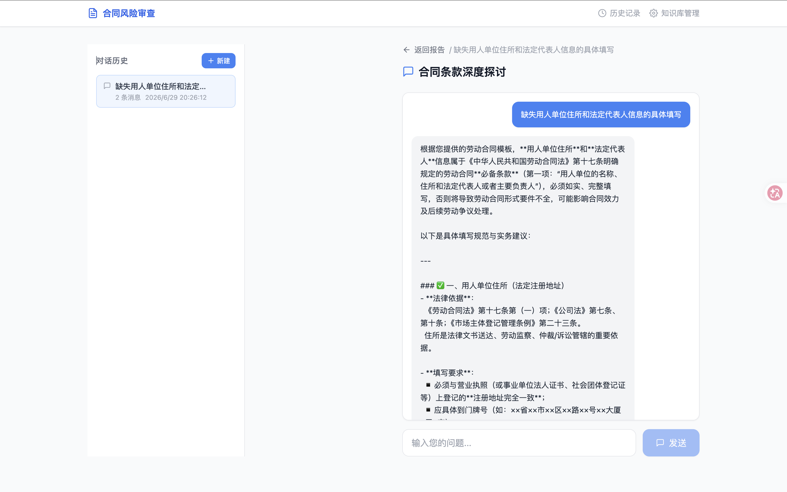
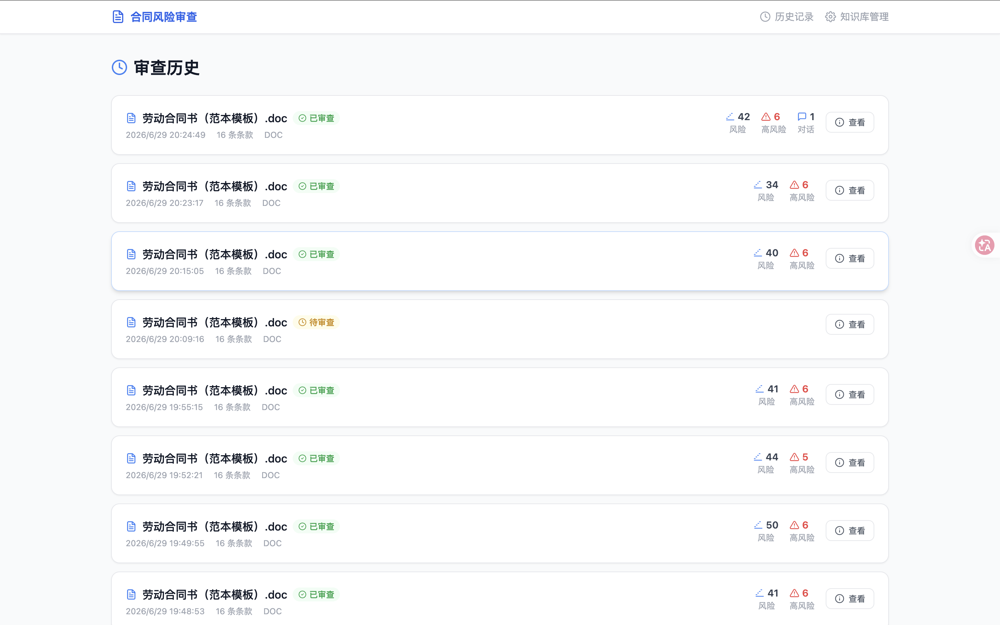
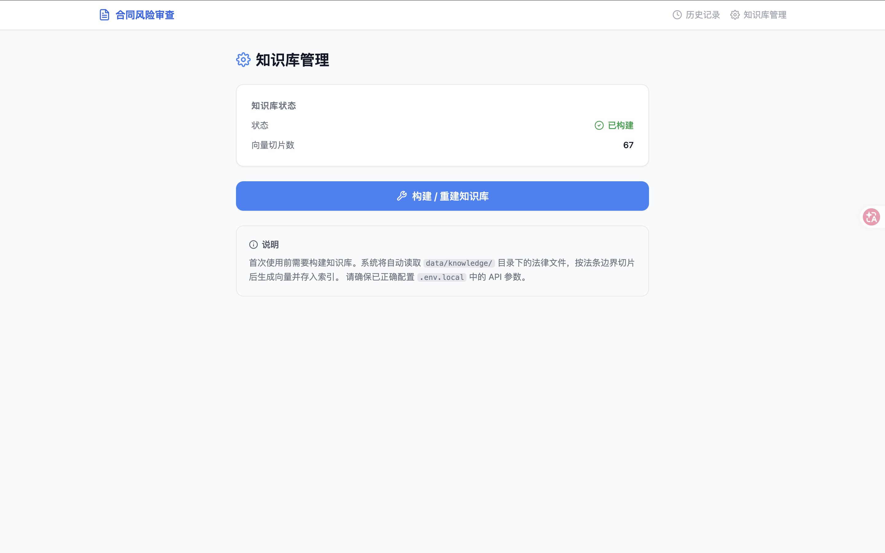
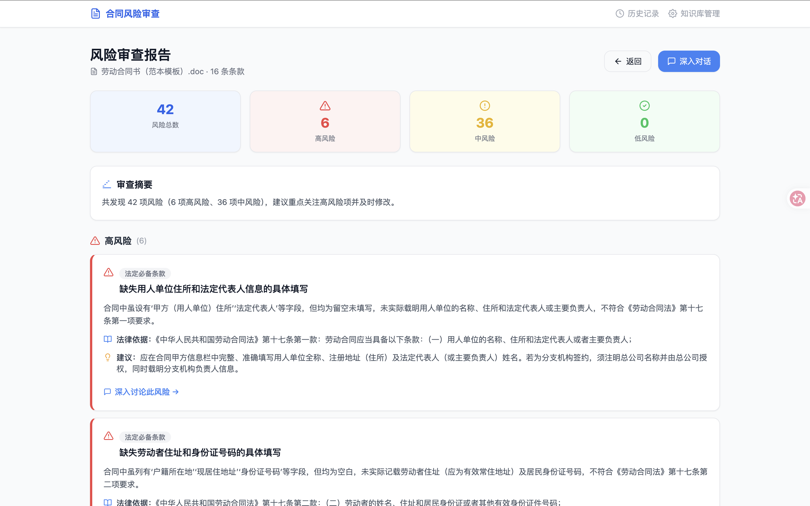

# labor-contract-risk-review-RAG

## 安装方法:

```sh 
git clone https://github.com/CCCCOOH/labor-contract-risk-review-RAG.git
cd labor-contract-risk-review-RAG
npm install # 安装依赖
npm run dev # 启动开发模式
```

## 预览：

首页：




风险对话：




审查记录：



RAG 法律文件知识库：



风险审查详情面板：


