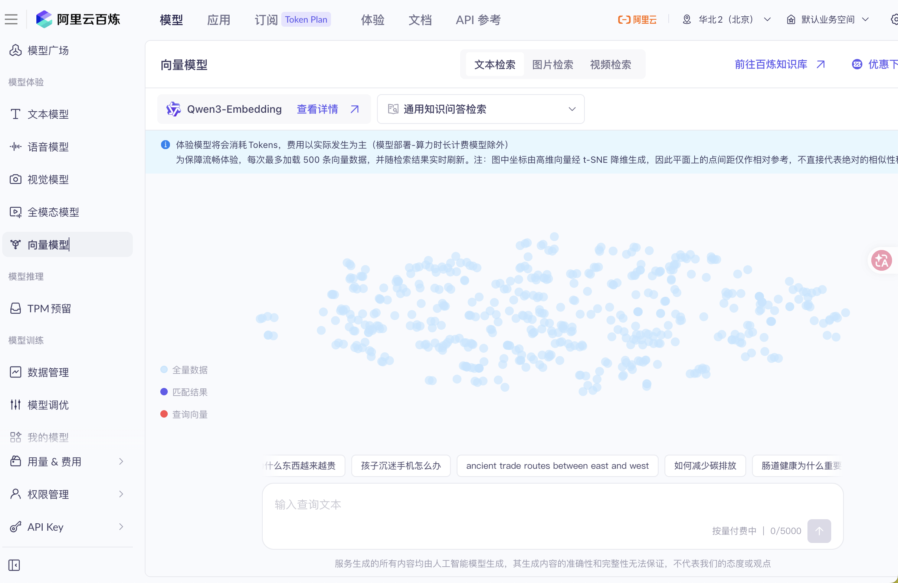
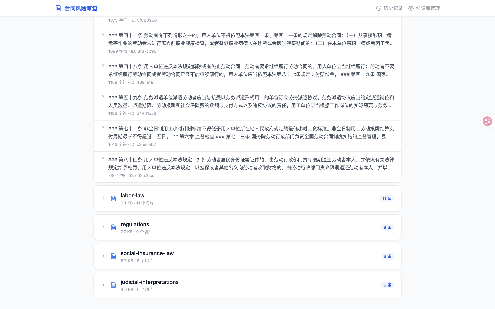
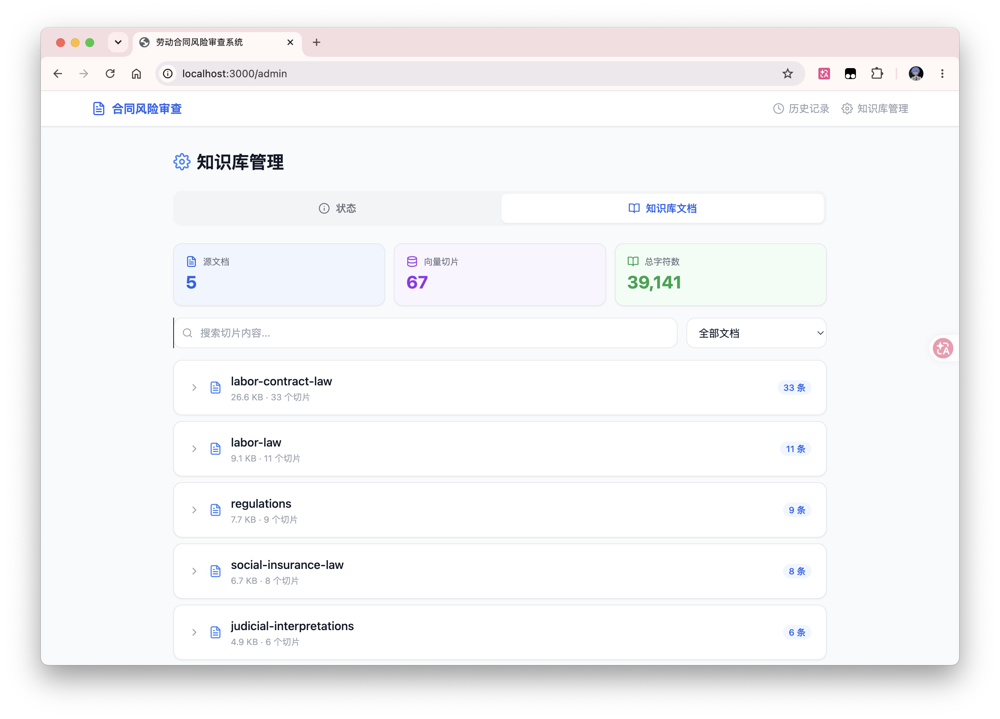
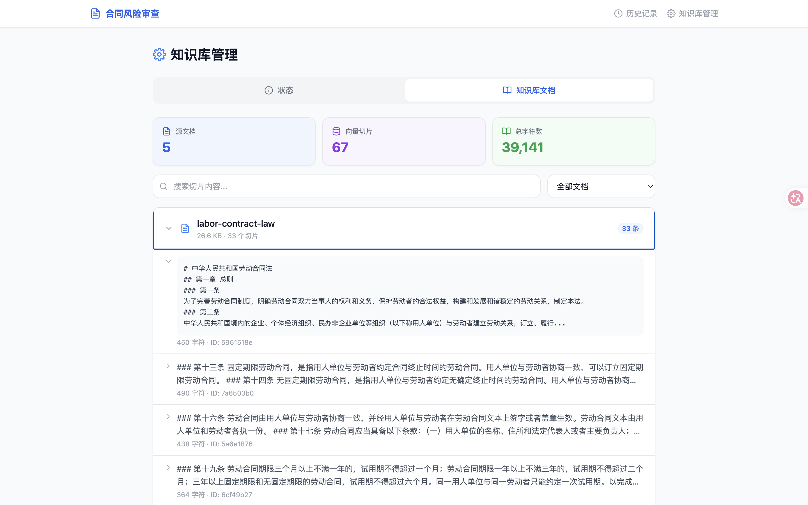

# 劳动合同风险审查系统 (Labor Contract Risk Review - RAG)

基于 AI 和 RAG（检索增强生成）的智能劳动合同风险审查系统。用户上传劳动合同文件，系统自动扫描 8 大法律维度，生成风险报告，并支持基于知识库的交互式问答。

## 技术栈

| 层级     | 技术选型                                                   |
| -------- | ---------------------------------------------------------- |
| 框架     | [Next.js 14](https://nextjs.org/) (App Router)             |
| 语言     | TypeScript                                                  |
| 样式     | Tailwind CSS                                                |
| 向量存储 | 本地 JSON 文件 (余弦相似度暴力搜索)                         |
| 文档解析 | `pdf-parse` (PDF) / `mammoth` (DOCX) / `word-extractor` (DOC) |
| 切片策略 | 正则法条边界分割 (`第X条`/`### 第X条`)                     |
| AI 接口  | OpenAI 兼容 API (Embedding + Chat Completion)               |

## 快速开始

### 前置要求

- Node.js >= 18
- 一个兼容 OpenAI 的 API 密钥 (支持 OpenAI、DashScope、DeepSeek 等)

### 安装

```sh
git clone https://github.com/CCCCOOH/labor-contract-risk-review-RAG.git
cd labor-contract-risk-review-RAG
npm install
```

### 配置环境变量

创建 `.env.local` 文件:

```env
OPENAI_API_KEY=sk-xxxxxxxxxxxxxxxxxxxx
OPENAI_BASE_URL=https://dashscope.aliyuncs.com/compatible-mode/v1
LLM_MODEL=qwen-plus
EMBEDDING_MODEL=text-embedding-v4
```

> `OPENAI_BASE_URL` 可替换为任何兼容 OpenAI 的 API 地址（如 DashScope、DeepSeek 等）。
> 开发测试是使用的阿里百炼大模型api：https://bailian.console.aliyun.com/cn-beijing?spm=5176.31175061.0.0.455c32a5rGka5F&tab=model#/api-key




### 启动

```sh
npm run dev      # 开发模式 (http://localhost:3000)
npm run build    # 生产构建
npm run start    # 生产启动
```

首次使用前，请先访问「知识库管理」页面构建知识库索引。

## 架构

### 核心流程

```
Upload → parseDocument() → splitClauses() → Contract (JSON 文件)
         ↓
Review → embedEachDimension() → vectorSearch(top-5 laws)
       → LLM(contract + law context + dimension prompt) × 8
       → parseFindings(JSON) → Report (JSON 文件)
         ↓
Chat   → embedQuestion() → vectorSearch(top-5 laws)
       → LLM(question + law context + contract snippet)
       → 持久化到 ChatSession (JSON 文件)
```

### 审查维度 (8 项)

系统从以下 8 个维度审查劳动合同:

1. **法定必备条款** — 是否包含《劳动合同法》第十七条规定的全部必备条款
2. **试用期合规性** — 试用期时长、次数、工资是否合规
3. **违约金条款** — 违约金约定是否超出法定范围
4. **竞业限制合规性** — 人员范围、期限、经济补偿是否合规
5. **工时与休假** — 工时制度、加班费、年休假是否合规
6. **社保缴纳** — 社保条款是否合规
7. **解除/终止合同** — 解除条件、经济补偿是否合法
8. **工资支付** — 支付周期、最低工资、加班基数是否合规

### RAG 工作流

```
知识库构建:
  data/knowledge/*.md → regexChunking(按法条边界) → embedBatch() → data/vectors.json

审查时检索:
  dimension.description → embedOne() → cosineSimilarity(vectors.json) → top-5 laws → LLM

对话时检索:
  user.question → embedOne() → cosineSimilarity(vectors.json) → top-5 laws → LLM
```

## 项目结构

```
src/
├── app/
│   ├── page.tsx                  # 首页 — 文件上传
│   ├── layout.tsx                # 全局布局 (Navbar)
│   ├── globals.css               # Tailwind 全局样式
│   ├── history/page.tsx          # 审查历史记录列表
│   ├── admin/page.tsx            # 知识库管理 (构建 + 文档浏览)
│   ├── report/[id]/page.tsx      # 风险审查报告页
│   ├── chat/[id]/page.tsx        # 交互式对话页 (含会话侧边栏)
│   └── api/
│       ├── upload/route.ts       # POST — 文件上传与解析
│       ├── review/[id]/route.ts  # GET/POST — 审查 (SSE 流式)
│       ├── chat/[id]/route.ts    # GET/POST/DELETE — 对话管理
│       ├── contracts/route.ts    # GET — 合同列表
│       ├── kb/route.ts           # GET — 知识库状态
│       ├── kb/build/route.ts     # POST — 构建知识库
│       ├── kb/content/route.ts   # GET — 知识库详细内容
│       └── config/route.ts       # GET/POST — LLM 配置
├── components/
│   ├── Navbar.tsx                # 导航栏
│   ├── Icons.tsx                 # SVG 图标库
│   ├── FileUpload.tsx            # 文件拖拽上传组件
│   ├── ReviewProgress.tsx        # 审查进度组件
│   ├── RiskReport.tsx            # 风险报告展示
│   ├── RiskCard.tsx              # 单条风险卡片
│   ├── ChatPanel.tsx             # 对话面板
│   └── LoadingSpinner.tsx        # 加载指示器
└── lib/
    ├── types.ts                  # TypeScript 类型定义
    ├── config.ts                 # 环境变量读取
    ├── store.ts                  # JSON 文件持久化
    ├── splitter.ts               # 合同条款分割
    ├── parser/                   # 文档解析器
    │   ├── index.ts              # 统一分发入口
    │   ├── pdf.ts                # PDF 解析
    │   ├── word.ts               # DOCX 解析
    │   └── doc.ts                # DOC 解析
    ├── rag/                      # RAG 引擎
    │   ├── index.ts              # 知识库构建 + RAG 查询
    │   ├── embed.ts              # Embedding API 调用
    │   ├── generate.ts           # Chat Completion API 调用
    │   └── api-client.ts         # HTTP 客户端 (超时/重试)
    ├── review/
    │   ├── dimensions.ts         # 8 个审查维度的专家提示词
    │   └── pipeline.ts           # 审查流水线 (并发 + SSE)
    └── db/
        └── lancedb.ts            # 向量存储 (JSON + 余弦相似度)
data/
├── knowledge/                    # 法律知识库源文件 (Markdown)
│   ├── labor-law.md              # 劳动法
│   ├── labor-contract-law.md     # 劳动合同法
│   ├── social-insurance-law.md   # 社会保险法
│   ├── regulations.md            # 相关法规
│   └── judicial-interpretations.md  # 司法解释
├── contracts/                    # 合同文件 (JSON)
├── reports/                      # 审查报告 (JSON)
├── chats/                        # 对话记录 (JSON)
└── vectors.json                  # 向量索引 (JSON)
```

## API 路由

| 方法   | 路径                  | 说明                     |
| ------ | --------------------- | ------------------------ |
| POST   | `/api/upload`         | 上传并解析合同文件       |
| POST   | `/api/review/[id]`    | 运行审查 (SSE 流式)      |
| GET    | `/api/review/[id]`    | 获取已缓存的审查报告     |
| POST   | `/api/chat/[id]`      | 发送对话消息 (自动保存)  |
| GET    | `/api/chat/[id]`      | 获取对话会话列表/详情    |
| DELETE | `/api/chat/[id]`      | 删除指定对话会话         |
| GET    | `/api/contracts`      | 获取所有合同列表         |
| POST   | `/api/kb/build`       | 构建/重建知识库          |
| GET    | `/api/kb`             | 获取知识库状态           |
| GET    | `/api/kb/content`     | 获取知识库详细内容       |
| GET    | `/api/config`         | 获取当前 LLM 配置        |
| POST   | `/api/config`         | 测试 LLM 连通性          |

## 页面路由

| 路径              | 说明                    |
| ----------------- | ----------------------- |
| `/`               | 首页 — 文件上传         |
| `/history`        | 审查历史记录            |
| `/report/[id]`    | 风险审查报告            |
| `/chat/[id]`      | 交互式对话 (含会话侧边栏) |
| `/admin`          | 知识库管理              |

## 数据持久化

所有数据以 JSON 文件存储在 `data/` 目录下:

- `data/contracts/<id>.json` — 合同内容与条款
- `data/reports/<id>.json` — 审查报告与风险发现
- `data/chats/<id>.json` — 对话会话与消息记录
- `data/vectors.json` — 向量索引 (含嵌入与原文)

> 向量存储使用本地 JSON 文件 + 余弦相似度暴力搜索，适用于 < 10K 条记录的场景。

## 关键设计决策

- **无外部数据库** — 全部使用 JSON 文件持久化，零运维成本
- **SSE 流式审查** — 审查进度通过 Server-Sent Events 实时推送，前端逐步展示
- **并行维度审查** — 8 个维度并发调用 LLM，通过 AsyncGenerator + SSE 逐个输出结果
- **智能文本切片** — 按 `第X条` / `### 第X条` 边界分割，合并小条款、拆分大条款
- **对话自动持久化** — 每次对话消息自动保存，支持多会话切换与管理

## 预览

首页：


风险对话：


审查记录：


RAG 法律文件知识库：


风险审查详情面板：


知识库向量可视化界面：




